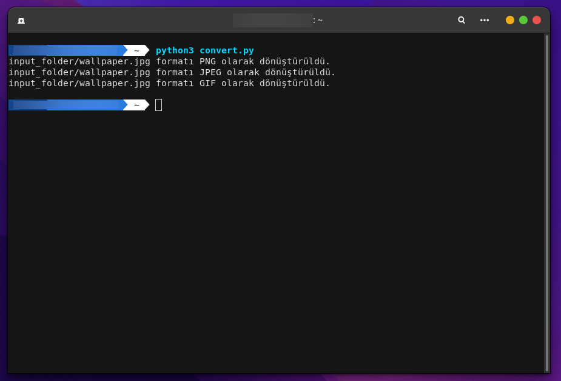

<a href="https://github.com/pedromxavier/flag-badges">
    
</a>

# PictureConvertFull
This python code I wrote creates a folder named input folder in the home directory and automatically converts the image file you put in the folder to GIF-JPG-JPEG-PNG formats at the same time.


Install Git Clone and Python3

Github Package Must Be Installed On Your Device.
```bash
sudo apt install git -y
```

Python3 Package Must Be Installed On Your Device.
```bash
sudo apt install python3 -y
```

----------------------------------
# Installation
Install PictureConvertFull
```bash
sudo git clone hub.com/cektor/PictureConvertFull.git
```
```bash
cd PictureConvertFull/
```

```bash
python3 convert.py
```


# Screenshot

   
